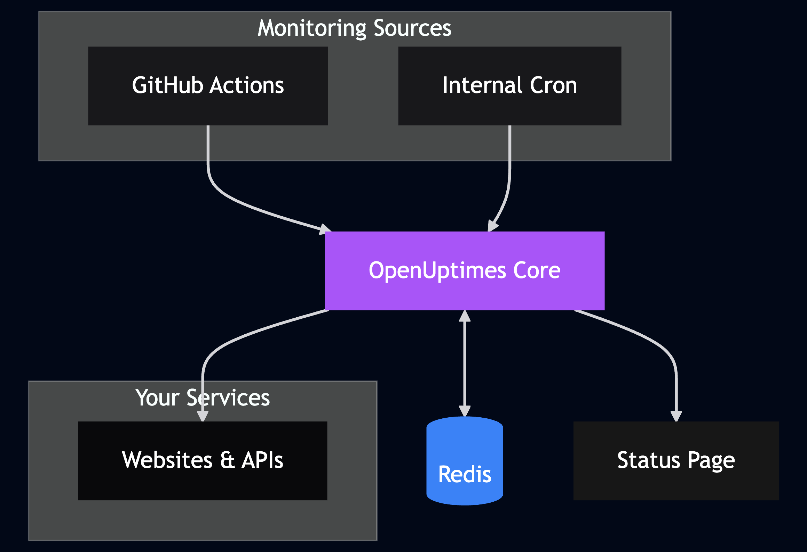

# Overview

## What is OpenUptimes?

OpenUptimes is a lightweight status page that helps you monitor and display service uptime. It provides a clean, modern interface for users to check the status of your services, with historical data to track performance over time.

## Why OpenUptimes?

There are many status page solutions available, but OpenUptimes stands out for its:

- **Simplicity**: Easy to set up and maintain
- **GitHub Actions Integration**: No need for external monitoring services
- **Minimal Dependencies**: Just GitHub, Redis, and your hosting provider
- **Clean Design**: Modern, responsive interface works on all devices
- **Low Overhead**: Minimal resource requirements

## Key Components

OpenUptimes consists of a few key components:

1. **Status Dashboard**: Public-facing page showing service status
2. **Admin Interface**: For managing services and settings
3. **GitHub Actions Monitor**: Automatic service checks
4. **Redis Backend**: Simple data storage for uptime data
5. **API Endpoints**: For programmatic access to service status

## Architecture

The architecture is designed to be simple and effective:

1. **GitHub Actions** periodically trigger the ping API
2. The **ping API** checks all services and updates Redis
3. The **frontend** displays status data from Redis
4. **Admin users** can configure services through the admin interface

## Who Should Use OpenUptimes?

OpenUptimes is ideal for:

- **Small to medium websites** that want a simple status page
- **Development teams** that want to communicate service status to users
- **Independent developers** who need a low-maintenance status solution
- **Open source projects** that want to provide transparency about uptime

## Getting Started

Ready to get started? Follow our [Installation Guide](installation.md) for detailed instructions.

!!! tip
    You can deploy OpenUptimes in just a few minutes with Vercel's one-click deploy!