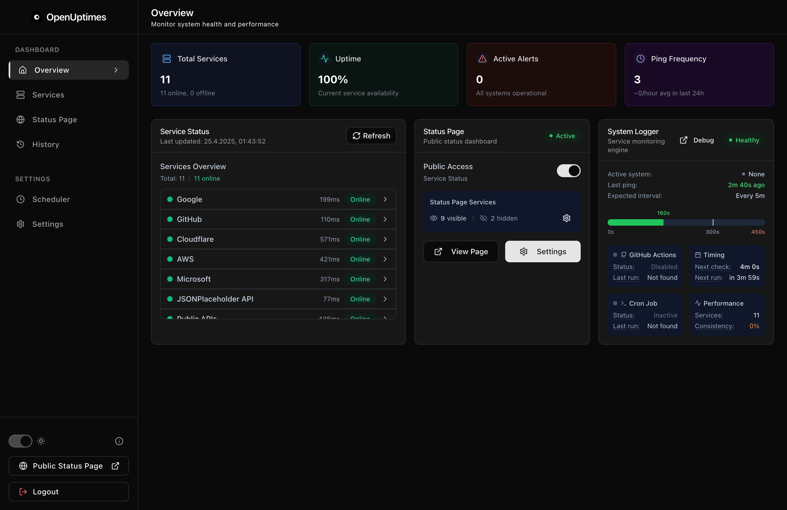

# OpenUptimes

  

  <strong>A simple, elegant, and self-hosted status page to monitor and display the uptime of your services.</strong>

<h2>Monitor Your Services</h2>

Track the status of your websites, APIs, and services with a beautiful, modern interface. Keep your users informed about service availability.

<a href="getting-started/installation/" class="md-button md-button--primary">Get Started</a>
<a href="about/" class="md-button">Learn More</a>

<h2>Flexible Monitoring</h2>

Choose the monitoring approach that fits your needs:

<ul>
  <li><strong>Internal Cron System</strong> - Precise control for self-hosted deployments</li>
  <li><strong>GitHub Actions</strong> - Perfect for serverless platforms like Vercel</li>
</ul>

## Key Features

- 🚀 **One-Click Deploy**
    
    Deploy to Vercel in seconds with zero configuration

- 📅 **Dual Monitoring**
    
    Choose between Internal Cron or GitHub Actions

- 📊 **Historical Data**
    
    Track uptime patterns with rich visualizations

- ⚙️ **Simple Admin**
    
    Easy-to-use dashboard for configuration

## Getting Started in 4 Steps

=== "1. Deploy"

    Click the "Deploy with Vercel" button and follow the prompts to set up your new project
    
    

=== "2. Configure Redis"

    Set up Redis in your Vercel project using their one-click integration

=== "3. Set up Monitoring"

    Choose your monitoring method based on your deployment type
    
    * [GitHub Actions](monitoring/github-actions.md) (for Vercel)
    * [Internal Cron](monitoring/cron-system.md) (for self-hosted)

=== "4. Add Services"

    Add your services through the admin dashboard at `/admin`
    
    

## Who Is It For?

OpenUptimes is perfect for developers, teams, and businesses who need a simple but powerful status page without the complexity and cost of commercial solutions.

- 🏢 **Small to Medium Businesses**
    
    Build customer trust with transparent service status

- 💻 **Development Teams**
    
    Communicate service status to users and stakeholders

- 👩‍💻 **Independent Developers**
    
    Monitor personal projects with a professional interface

- 🌐 **Open Source Projects**
    
    Show uptime transparency for community services

  <a href="about/" class="md-button md-button--primary">Learn More About OpenUptimes</a>
  <a href="getting-started/installation/" class="md-button">Installation Guide</a>

